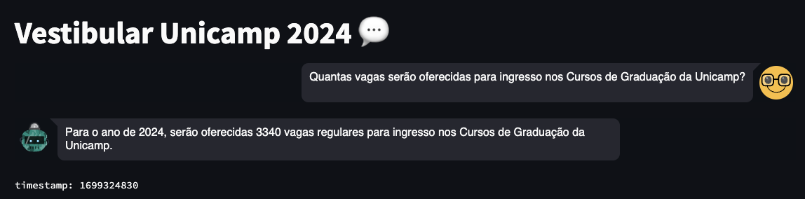
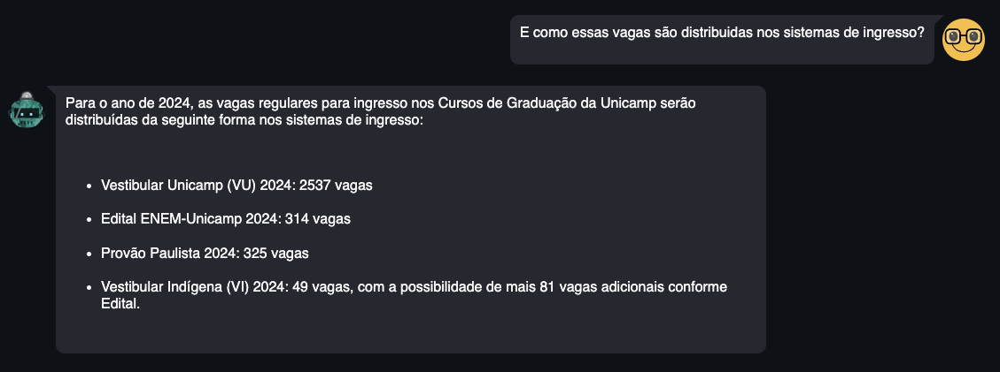

# Unicamp RAG Chatbot.
Este relatório fornece uma visão geral da implementação e avaliação do chatbot desenvolvido. Ele abrange detalhes de implementação, resultados da avaliação e orientações sobre como testar o chatbot.

## Detalhes da Implementação:

**Descrição Geral do Chatbot:**
O chatbot foi desenvolvido para fornecer respostas a perguntas relacionadas ao Vestibular da Unicamp 2024 com base na Resolução GR-031/2023, de 13/07/2023, que contém informações sobre o vestibular. Ele utiliza uma abordagem de processamento de linguagem natural para compreender as perguntas dos usuários e gerar respostas contextuais.

## Arquitetura do Chatbot:

A arquitetura do chatbot é composta por vários componentes:

- **Base de Conhecimento:** A base de conhecimento é criada a partir do documento PDF "vestibular_unicamp_2024_infos.pdf". O texto do PDF é extraído usando a biblioteca PyPDF2 e dividido em pequenos trechos chamados "chunks". Os embeddings de texto da OpenAI são usados para representar esses chunks. A base de conhecimento é otimizada para pesquisa de similaridade de texto usando FAISS.

- **Modelo de Linguagem:** O modelo de linguagem GPT-3.5 Turbo da OpenAI é usado para compreender e gerar respostas para as perguntas dos usuários.

- **Cadeia de Processamento de Perguntas e Respostas:** Uma cadeia de processamento de perguntas e respostas (chain) é carregada com base no modelo de linguagem. Esta cadeia facilita a interação com o modelo de linguagem e a geração de respostas contextuais.

## Integração com Plataformas:

O chatbot é integrado com plataformas de mensagens e é acessível a partir do [Streamlit](https://joaomadruga-rag-chatbot.streamlit.app/). Os usuários podem iniciar uma conversa com o chatbot e fazer suas perguntas diretamente por meio dessas plataformas.

## Resultados da Avaliação:

### Métricas de Desempenho:
O desempenho do chatbot é avaliado com base em métricas críticas, incluindo precisão e custo. Os resultados refletem a capacidade do chatbot de compreender e fornecer respostas precisas aos usuários. Com base no nosso dataset de validação, ele alcançou uma taxa de assertividade de 87.5% nas respostas fornecidas pelo chatbot. Além disso, é importante destacar que o custo médio por interação é bastante eficiente, com um valor aproximado de $0.0054 por pergunta, ou seja, $0.0877 dólares para 16 perguntas respondidas. Essas métricas demonstram a qualidade e a eficiência do chatbot.

### Exemplos de Diálogos:
Diálogos reais entre os usuários e o chatbot são coletados para demonstrar a interação. Esses exemplos mostram que o chatbot é capaz de responder de forma precisa e contextual às perguntas dos usuários.


<p align="center">Mais exemplos podem ser identificados na pasta examples.</p>

**Desafios Identificados:**

Durante o processo de conversão do PDF em texto utilizando a biblioteca PyPDF2, pude observar que algumas informações, especialmente aquelas contidas em tabelas, não foram devidamente identificadas. Portanto, áreas para aprimoramento futuro incluem a necessidade de isolar e reestruturar tabelas e aperfeiçoar a organização de informações mal estruturadas no PDF. Essas melhorias visam aprimorar a qualidade e a integridade da base de conhecimento.

## Como Testar o Chatbot:

**Orientações para Testadores:**
Os testadores podem acessar o chatbot por meio do [Streamlit](https://joaomadruga-rag-chatbot.streamlit.app/). Cada resposta gera um timestamp e um custo, existindo um limite que pode ser atingido de $5 dólares na API do OpenAI.

**Cenários de Teste:**
Os cenários de teste incluem perguntas sobre datas de inscrição, requisitos de admissão, programas de estudo e outras informações relevantes ao vestibular.

**Testando localmente:**

Para realizar testes em seu ambiente local, siga estas etapas:

1. **Clone o Repositório:**

   ```bash
   git clone https://github.com/joaomadruga/RAG_chatbot.git

2. **Instale as dependências:**

   ```bash
   pip install -r requirements.txt

2. **Execute o streamlit:**

   ```bash
   streamlit run main.py

É de suma importância configurar a env localmente. É possível seguir o exemplo do arquivo .env.example.